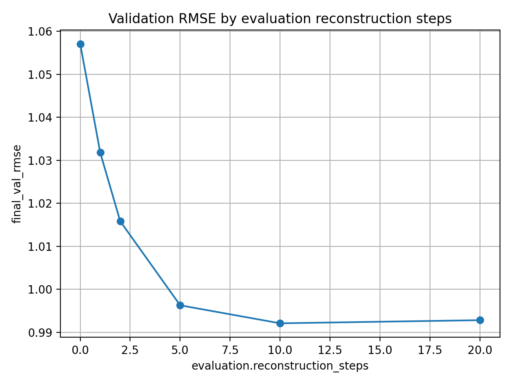
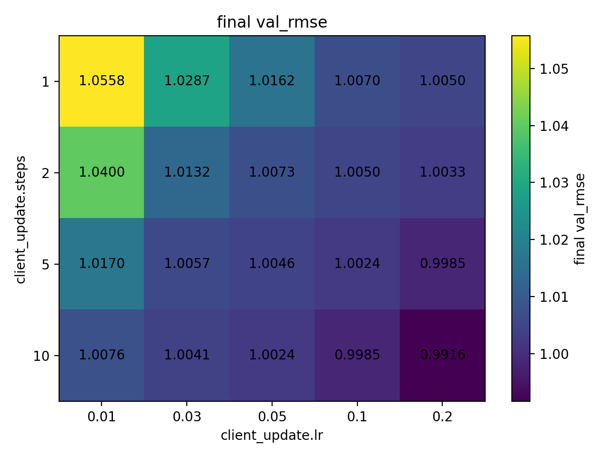
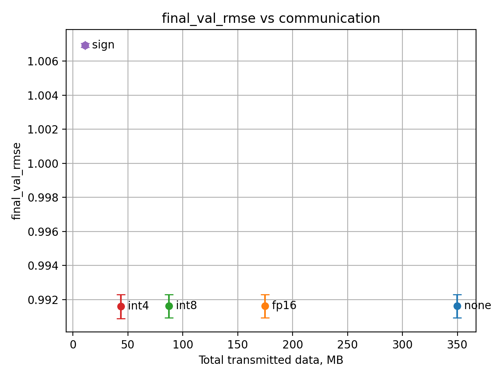
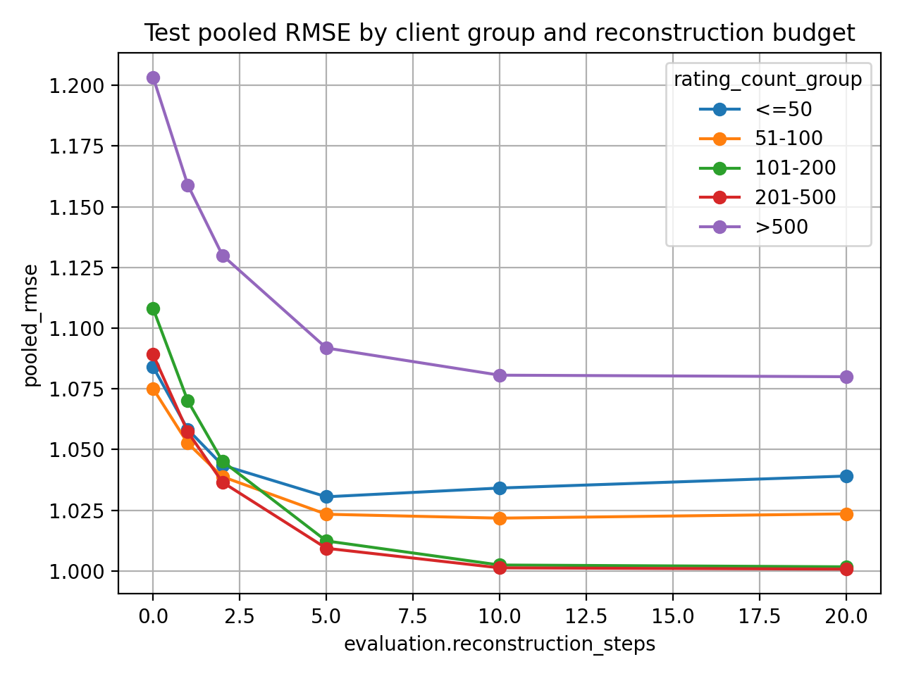

# Federated Reconstruction Experiments

PyTorch simulator for partially local federated learning in recommender systems. The project studies **Federated Reconstruction (FedRecon)** for matrix factorization on MovieLens 1M: user-specific parameters are reconstructed locally on the client, while global item parameters are updated through federated aggregation.

The repository was prepared as a course project and an experimental playground for comparing FedRecon with baseline approaches, reconstruction budgets, client update budgets, quantization of global updates, client heterogeneity, and simulated client dropout.

## Task

The recommendation task is rating prediction on **MovieLens 1M**. Each user is treated as a federated client. For validation and test users, local ratings are split into:

- **support set**: used to reconstruct the user profile locally;
- **query set**: used to evaluate recommendation quality after reconstruction.

The model is matrix factorization with optional bias terms:

```text
prediction(user, item) = user_embedding · item_embedding + user_bias + item_bias + global_bias
```

In the partially local setting:

- local parameters: user embedding and user bias;
- global parameters: item embeddings, item biases, global bias.

Only global parameter updates are sent to the server. User profiles are reconstructed on the client and are not aggregated.

## Implemented methods

- **FedRecon**: partially local federated matrix factorization.
- **FedAvg-like global baseline**: clients train local user profiles and global parameters, but only global deltas are aggregated.
- **Centralized MF + ReconEval**: centralized matrix factorization used as a non-federated quality reference.
- **Compression variants**: none, fp16, int8, int4, sign.
- **Client dropout simulation**: selected clients may fail to return updates.

The implementation is written in **PyTorch**. It does not use TensorFlow Federated; experiments are configured with YAML files and executed through CLI scripts.

## Key results

Main 100-round comparison on MovieLens 1M test users:

| Method | Test RMSE | Test MAE | Accuracy |
|---|---:|---:|---:|
| FedRecon | 1.0035 ± 0.0007 | 0.8088 ± 0.0003 | 0.3759 ± 0.0001 |
| FedAvg-like | 1.0032 ± 0.0005 | 0.8085 ± 0.0006 | 0.3760 ± 0.0008 |
| Centralized MF + ReconEval | ≈ 0.881 | ≈ 0.700 | ≈ 0.431 |

Main observations:

- Local reconstruction is important for new users: increasing evaluation reconstruction from 0 to 5–10 steps substantially reduces validation RMSE.
- Increasing the number of local client update steps improves quality for a fixed number of communication rounds, but increases client-side computation.
- Moderate quantization of global deltas is effective in this simulation: int4 gives almost the same RMSE as full precision while reducing transmitted data strongly.
- Sign-only compression is too aggressive and noticeably degrades RMSE.
- FedRecon and the FedAvg-like global baseline are very close in the main setting; the centralized baseline remains better because it is trained without federated constraints.

## Selected figures

### Evaluation reconstruction budget



### Client update steps and learning rate



### Quantization trade-off



### Client groups and reconstruction budget



## Repository structure

```text
configs/                 YAML configs for experiments and sweeps
scripts/                 CLI entry points for training, sweeps, plots and summaries
src/fedrecon/            Core implementation: data, models, algorithms, simulation, analysis
results/final/           Selected final tables and figures committed to the repository
notebooks/               Optional exploratory notebooks / Colab notes
docs/                    Short experiment summary and project notes
data/                    Local dataset directory, not committed
```

## Installation

Recommended on Windows PowerShell:

```powershell
cd C:\RFoE\CW_Project\fedrecon-course-mvp
python -m venv .venv
.\.venv\Scripts\Activate.ps1
python -m pip install --upgrade pip
pip install -r requirements.txt
```

## Data

The project expects MovieLens 1M under `data/`. Raw data are not committed to the repository.

Expected local layout after downloading and extracting MovieLens 1M:

```text
data/
  ml-1m/
    ratings.dat
    movies.dat
    users.dat
```

## Quick run

A short debug run:

```powershell
python scripts/run_experiment.py --config configs/debug.yaml
```

A stronger 100-round FedRecon run:

```powershell
python scripts/run_experiment.py --config configs/fedrecon_strong_100r.yaml
```

FedAvg-like baseline:

```powershell
python scripts/run_fedavg_global.py --config configs/fedavg_global_100r.yaml
```

Centralized matrix factorization baseline:

```powershell
python scripts/run_centralized_mf.py --config configs/centralized_mf_baseline.yaml
```

## Reproducing sweeps

FedRecon 100-round multi-seed sweep:

```powershell
python scripts/run_sweep.py --config configs/sweep_fedrecon_strong_100r_v1.yaml
```

FedAvg-like 100-round multi-seed sweep:

```powershell
python scripts/run_fedavg_sweep.py --config configs/sweep_fedavg_global_100r_v1.yaml
```

Quantization sweep:

```powershell
python scripts/run_sweep.py --config configs/sweep_quantization_eval10_strong_update_v1.yaml
```

Dropout stress test:

```powershell
python scripts/run_sweep.py --config configs/sweep_dropout_clients_stress_v1.yaml
```

## Final artifacts

The directory `results/final/` contains selected figures and tables used in the course paper and presentation:

```text
results/final/
  figures/
  tables/
  README.md
```

The final artifacts are intentionally committed, while raw experiment runs are ignored by Git.

## Limitations

- MovieLens 1M is much simpler than real cross-device federated learning scenarios.
- Communication cost is estimated from transmitted global deltas and does not model real network behavior.
- Differential privacy is not implemented.
- The paper-like experiment is a qualitative sanity check rather than a full reproduction of the original FedRecon paper.
